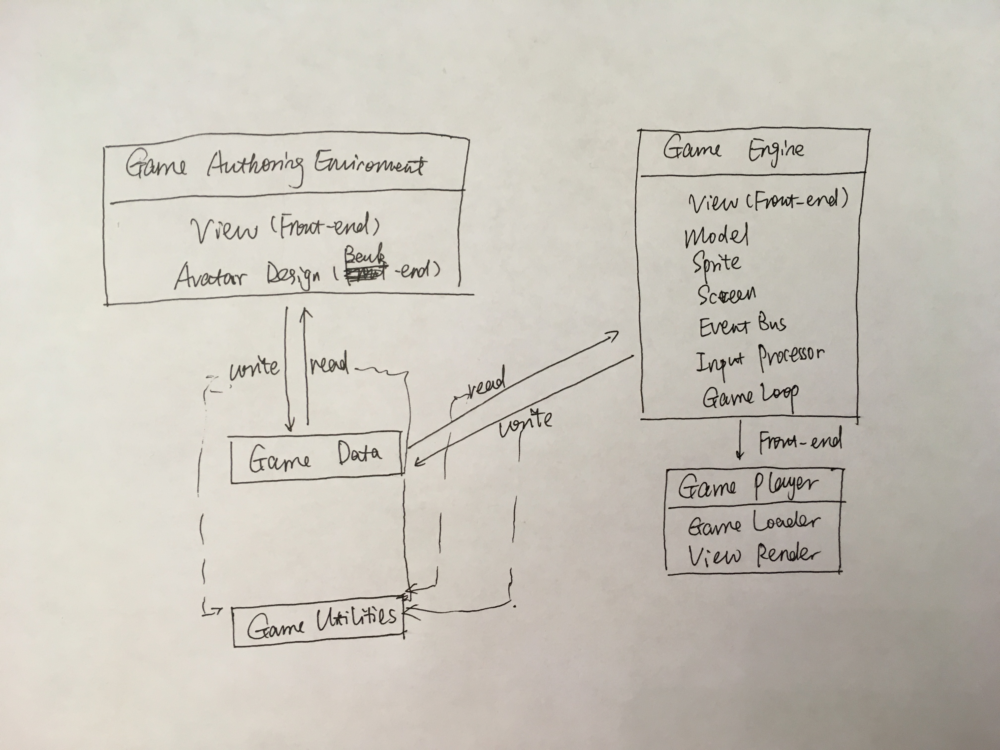
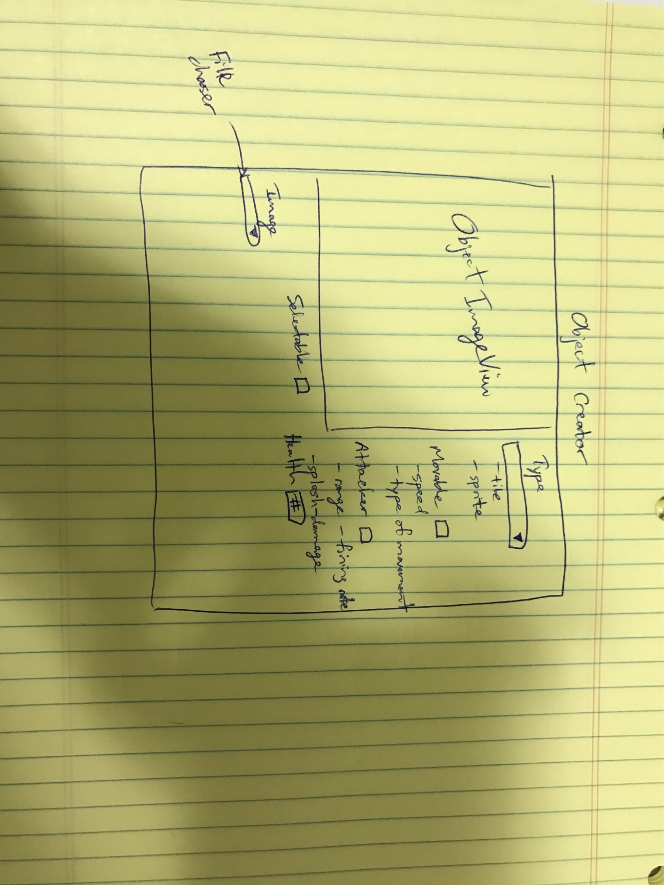
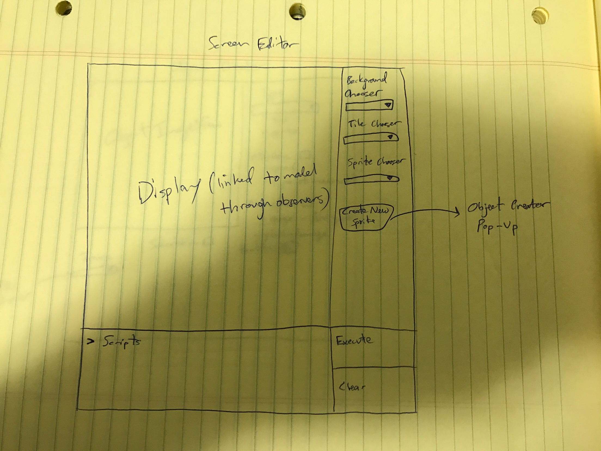
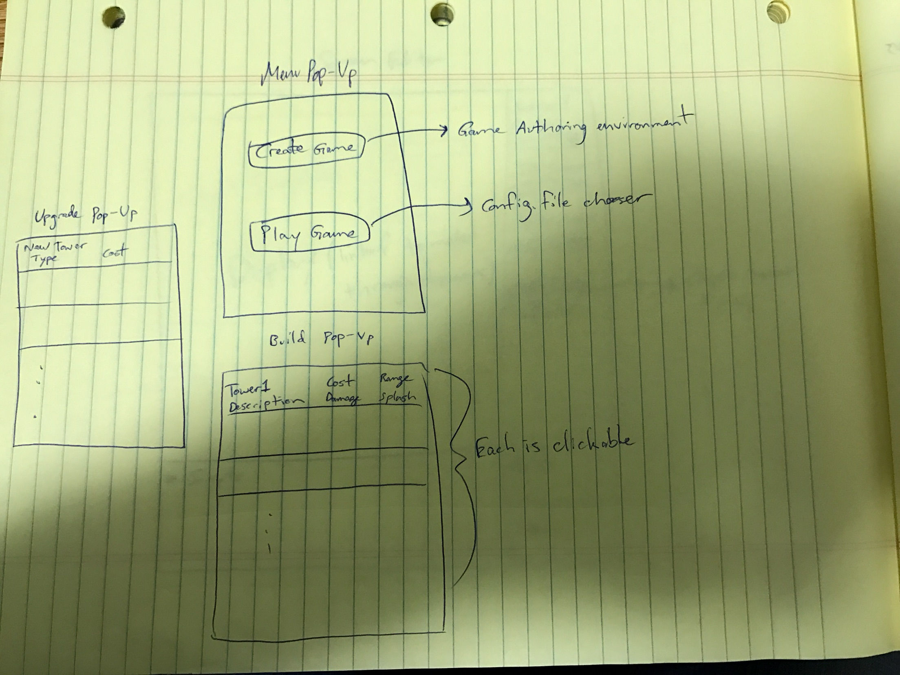
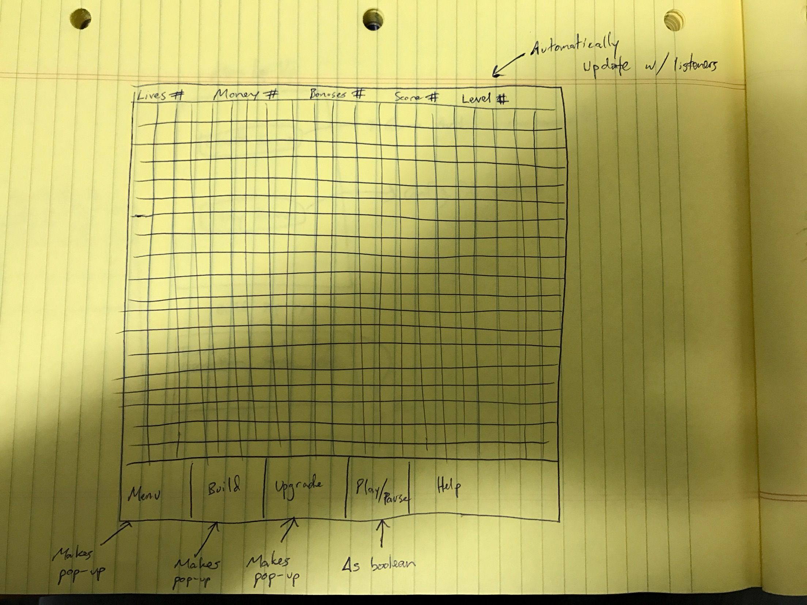

## Introduction ##

 - Describe the problem your team is trying to solve:
  - The initial goal of this project is to create a platform that supports the creation of a Tower Defense game, and allows a user to set-up the specifications of his/her own game and then run this game. This means that we must try to create an environment which allows the user to build a wide variety of game with a wide variety of specifications. The goal is to empower the game designer by creating a framework which is both easy to use and works for many different kinds of games. In order to do this, we are building different hierarchies for objects that share some qualities but leave flexibility and specifications up to the developer, allowing for dynamic changing of game units’ behaviors, and limiting dependencies between components of our project with a central place for behaviors to be handled and executed. 
 - Describe the primary design goals of the project (where is it most flexible):
  -  The primary design aspect of our project is to have one centralized place where all of the changes that occur throughout the duration of the game is handled. This is handled by the event bus which is the core of our event-based system. We compare this event bus with the dependency injection pattern, where instead of having every object in the project depend on something else to execute its functionality, it passes it off to the event bus to take care of. The good thing about using events is to reduce dependencies between all of the components and the fact that it eliminates the need for a bulky controller class. We will also be using composition, a method of dynamically changing the attributes/behavior of the sprites of our game. These interchangeable components will implement set interfaces, allowing for different implementations of components which will thus allow for maximum flexibility and extensibility for the sprites.
 - Describe the primary architecture of the design (what is closed and what is open):
  - Ideally, we would like the project to remain as encapsulated as possible. To do this, we have kept certain parts of our program invisible to the user and to other components of the program. The most accessible aspect would be the event bus, since almost every corner of the program will need to trigger an event or be altered by an event handler. We are going to keep the data of the entire program stored in one central location (things like the location of all the sprites, the points, the time remaining, the configuration of the map, etc). This will be held by the model and the subcomponents of the model. The tricky part is deciding which components of the program will have access to this model. We would like to keep this limited. We want to accomplish this while also making sure the actors themselves will be executing their own logic and making their own decisions. Classes which are supposed to perform actions, such as towers which shoot monsters, or monsters which move down a line, should all implement the actor interface. This means they have an act() method which is called regularly by the game loop, and they are instantiated with access to a portion of the Model- a data structure that keeps track of the data that is specific to each playthrough of a game. They are also given access to the EventBus, which is a class that has access to the model and can modify the various components of the game. In such a fashion, in each game loop, the run() methods of Actors are called. Actors can then need to call the Model to receive the data they need, then pass events to the EventBus so that the Actors can modify other components of the games. 
 - Describe your chosen game genre and what qualities make it unique that your design will support:
  - We chose the tower defense genre of games. This genre has a map with a landscape that is chosen by the user, and also has different sprites that all have different abilities. Some will move and some won’t, some can attack while others can’t, etc. The goal is to defend your territory by placing different defensive characters around and on your territory. Thus, the user is given the power to configure the map in the beginning. This is an important feature of tower defense games. Users might also be allowed to repair the territories as the game proceeds, as well as replace and upgrade the map. In order to allow users to upgrade some features of the map, there needs to be a currency outside of the levels that keeps track of ability to upgrade. This means there are both points that are earned in the levels and then also currency that is earned and saved from level to level. 
 - Discuss the design at a high level (without referencing specific classes, data structures, or code):
  - Our project is split up into three primary components: the Game Engine, the Game Authoring Environment, and the Game Player. There is also another supporting component (Game Data) but this is primarily just data files. The Game Engine is the bulk of the back-end of our program. It is where the modules that encompass the actual meat of the game are created, and where they are capable of interacting with one another. This includes the characters of the games, the map, and the data related to the games. The Game Authoring Environment is the user interface where users will have the power to configure their levels, design their characters, choose the starting parameters of the game, etc. The Game Player will be the window that allows users to look into the actual game; it’s where the animation and playing actually happens. 

## Overview ##
- Describe how and why the program was divided up:
 -  The project is divided into 5 major parts, namely game authoring environment, game engine, game data, game player, and game utilities, and the first two are the most important and time-consuming parts. We felt this was the best way to divide up the project because these are the set of the main components that need to work together to get our game creation platform to run. 
- Describe how the individual parts work together to provide the desired functionality:
 - The game authoring environment provides an interactive GUI for game designers to design every aspect of their games. The game engine consists of a set of classes to support the common game logics of all tower defense games. The game data are files (xml, sound, image, Java resource files, etc) that transfer information between the game authoring environment and the game engine. The game player loads game data and uses the game engine to run a particular game and allows users to play it. And game utilities are a bunch of classes used by all other four parts, working on writing data to files, reading data from files, and other possible general utility tasks.
 - Together these five parts can achieve the desired functionality of editing games and running games. From the splash screen of the program, the user can choose between “design a game” or “play a game”. For the first choice, the user enters the game authoring environment, and uses the GUI and the script to generate his game (including game structures, game rules, layouts of game sprites in each level, and other assisting sections like statistics display and friend systems), and finally the user can save the entire game map to a file (game data) for future use. For the second choice, the user can play some default games provided by our system, or load an existing game map (game data created by the game authoring environment or even downloaded from the Internet) and play it. The game player is responsible for rendering game display, while the game engine is responsible for maintaining the process of the game. The game utilities will work when we need to save data to files or read data from files.

- Describe specific modules you intend to create and their purpose with regards to the program’s functionality:
 - Game Authoring Environment:
      * Avatar Design
          -  Map Design: the layouts of the game (the positions and functions of tiles, sprites, etc)
          - Sprite Design: the image, skills, and positions of each type of sprites
          - Screen Design: the general screen layout
          - Scripting: the functionality of design via script
     * View: the view of the game authoring environment (represented by JavaFX components)
     * XML Writer and Reader (shared component of utilities)
 - Game Engine:
         - Sprite: definitions of all entities in the game that will be shown on the game screen
          - Sprite will be a container for different attribute classes which will then determine the behavior of the sprite. Because of the wide range of combinations of attributes sprites can be anything from a tile (a simple, unselectable background piece) to a flying, selectable warrior.
         - Model: the module to hold all things in the game (including sprites and other game statistics)
          - SpriteModel: a collection of all sprites in the game
               - getReadOnlySprites()
            - StatsModel: a collection of all game statistics
              - getPoints()
              - getLives()
              - getHealth()
              - getTimeRemaining()
              - getBonuses()
         - View: the view of all game entities (represented by JavaFX components, but rendered by the Game Player)
          - MapView
             - resetMap()
             - MenuBar  (no public methods)
             - StatsBar (no public methods)
             - ScreenView 
                 - instantiate()
         - Screen: the part to set up different pages for the view, corresponding to the screen design module in the game authoring environment
         - Event Bus: the central of the event-based game engine, to transform events around all modules of the game engine
          - On(EventType, EventHandler)
          - Off(EventType, EventHandler)
          - Emit(Event event)
         - Input Handler: the part to process inputs during the game, inputs can include real user inputs from mouse, keyboards and other possible input devices, inputs from the AI, inputs from the Internet, etc.
          - Include many event handler classes
         - Game Loop: the JavaFX game loop
         
    * Game Data: 
     * Files (GIFs, XML, MP3s, Java Resource Files): game data files
    * Game Player (Runner):
     * File Loader: ask the user to load a specific game and pass the game files to the game engine
          * loadGameFile()
        * Game Progressor: manage the progress of the game (like choosing levels, quitting games)
         * nextLevel()
   * Utility - Resource Loader:
     * Data Handler: manage data and the program
         * serializeToXML()
         * deserializeFromXML()
         
- Include a picture of how the modules are related (hand drawn or drawing program or screen shots):

## User Interface##
* Describe how the user will interact with your program:
 * The user can interact with the program in multiple ways. First, the user can drag some components for the game, like a sprite and some towers. The user just needs to use mouse to drag necessary parts in the screen.
 * The user can also use script to control some parts in the game, like the exact location and angle of some sprites.
 * The user can choose the game that we created for later use. He/she can choose one of the examples to play with. The interesting part is that he/she can make his or her game in the specified genre.
* Describe the overall appearance of program’s user interface components and how users interact with these components:
 * There will be a standard screen which is the component for running the game. All the game will be shown  in this screen.  The user can create their own game by dragging the necessary components for their game. The advanced users can also choose to use the script console to adjust the function and appearance of their games. 
 * For some RTS games, there will be other parts, like the camera which will be used to zoom in or out some special parts on the map. The user can use mouse to control the size of some locations.
 * There will be some nodes showing the game statistics of the game, like the health, the scores, the number of enemies, etc. 

* Describe how a game is represented to the designer and what support is provided to make it easy to create a game:
 * A game is represented to the designer as a set of options that are readily apparent with drop down menus and user input boxes and through the scripting, which will only be done in the second sprint. This scripting will ideally allow the user to change more dramatic aspects of the game like winning/losing a level condition, but can also be used to change many aspects of the game like number of starting coins and number of levels. We will also provide some default values and examples so that the user can load these into the game authoring environment and change some values while having a properly running game to start from instead of starting from scratch.
* Describe any erroneous situations that are reported to the user (i.e., bad input data, empty data, etc.):
 * We will have both bad input and empty data messages displayed to the user so that if they are trying to save a game that will certainly not run in any meaningful way (like an empty winning condition, or no sprites created) then we will tell them about that situation. 
 
 ## Design Details ##
* Describe how each module introduced in the Overview handles specific features given in the assignment specification:
 * The game engine will be one of the main parts of this project. The game engine will need to control the game as a whole, updating it, handling collisions, etc. It will deal with the logic to create the game, to run the game , to change the parameters of the parts in the game. The definition of a game engine put forth in the assignment specification is: framework of general Java classes to support any kind of game within a specific game genre. This engine will fulfill those requirements by providing flexible java classes which will be able to handle a wide variety of rules and interactions among sprites. 
       * Sprite: Sprite will be the basic building block for which designers can create interactable objects in the game. By being flexible it will handle creating all the characters (heroes, enemies, etc.) for the game designer.
       * Model: This module will keep track of the state of the current game and this is important for updating the game and saving the game’s state. This will be essential for the actually playing of the game as well.
       * View: This module will be what the user sees when playing the game. It will be important for displaying game status information as well.
       * Event Bus: This is the brain of the game engine, delegating tasks in our event-based system and allowing for a clean updating of the game. This module doesn’t implement a specific feature per say but is essential for overall success.
       * Input Processor: This module will allow us to create user interaction with game, an important feature for any type of game.
       * Game Loop: This module is essential for actually updating the game which is of course an important feature of the assignment.
   * Game Data: game data is essential for saving state and reloading state in a given game. This will be an essential feature for letting users save their creation and come back to them later on to further edit or play their product. 
     * Files: The only module in Game data are the resource files for the game to actually run (including the image files, sound files, and XML files). This of course is an important resource module for handling displaying the game and saving the game. 
    * The game authoring environment is another important part of the project. It is the user-interface provider of the game. The game authoring environment will provide all the parts needed for the game. The user can choose any component provided to assemble a game. There are multiple ways to change the game. One way is to use the mouse to control the component of the game. The user can by selecting and clicking some javaFX nodes to change the properties of the game. Another way to change the game is to use the script. Users can input codes to control the behaviour of javaFX nodes. 
     * AvatarDesigner
         * SpriteDesigner: this will allow the user to select from some drop down menus and some clickable boxes and some user input boxes to create completely customizable sprites. Each of these methods will change some aspect in the model.
         * MapDesigner: this will allow the user to select from some preset maps (saved as files) or be able to create a custom map made from a bunch of different tiles. Once a custom map is created it can be saved into a file that will be read into the model by the game engine upon playing that game. 
         * ScreenDesigner. Only private methods. Will use methods in Page module. This will simply place different UI components on the screen at different times. Does not affect the back end and is self-contained. 
    * The game authoring environment should be able to decide what goes on each screen of the game. It will be used to produce a folder of game data, which contains of folder of resources used for sound and images, a folder of classes, which were either authored using the game authoring environment, or created using some of the game authoring environments preset options. It should also contain the XML version of a Model. The Model stores data that is not specific to any particular screen of the game, such as the player’s score and the player’s lives. However, it is also subdivided into multiple ScreenModels. ScreenModels hold the data concerning how each screen should be populated. It also keeps track of exactly what kinds of objects the screen will be populated with. For example, a Knight class might be stored within the “Class” folder, but the object specific parameters such as starting health, speed and position could be set within the ScreenModel.
    * The game player is a GUI to display the initial game setting part, which allows the user to load a game file. After the game file is loaded, it is handed to the game engine and the game starts to run. The display of game progress is managed by the view module in the game engine. When a level ends, the game player displays a transition page for the user to choose if to move on to the next level, or to restart an old level, or to quit to game.
* Describe what resources are used by each module introduced in the Overview:
 * The game authoring environment uses Groovy to handle scripts and xStream to save program data. It will also make use of a “Resource” folder for images and sounds, though users can implement images and sounds in the authoring environment without requiring that they come from the folder labeled “Resource”.
 * Game Engine:
      * Sprite: none
      * Model: none
      * View: Will use image files for the different components of the view
      * Event Bus: none
      * Input Processor: none
      * Game Loop: none
   * Game Player:
     * GameLoader: Needs game files to load the saved games state into the actual player
* Describe how each module introduced in the Overview collaborates with other modules:
 * Game Engine:
     * Sprite: This will be used to create all the monsters, towers, and other enemies. This will contain other feature for all attributes of these kinds of sprites. From their instance , they can have different abilities, like attack ability, selectability, etc.
     * Model: The model will store all the information, so it will have data structures that store things like Sprites. The Event Bus also has the capability of accessing information from the Model.
     * View: This is where all of the information will be displayed. It will need to take information from the Model and be paced by the Game Loop. It will change what is being displayed on each Screen according to the changes made along each Game Loop.
     * Event Bus: Is the brain behind all the interactions between the modules. This will be responsible for handling, adding, and subtracting listeners for the different components which will allow for updating through events. This is essential for the event-based system we are creating. 
     * Input Processor:Will be used by other modules to successfully translate the different types of input into events which will then activate other modules to update
     * Game Loop: Will call the other modules to update themselves. This is sort of the brain of the animation aspect of the game.
   * Game Player:
     * Game Loader: loads up the saved game state from a specific file which is essential for creating the state for the other modules and allowing a game to run through the game engine.
* Describe how each module introduced in the Overview could be extended to include additional requirements:
 * Game Engine:
     * Sprite: Sprite will easily extendable because it is a container for attributes. The attributes are just concrete implementations of a set interface. If someone wanted to create a new version of a certain attribute they would just create a new subclass that implements this interface for that attribute (there would be a set naming convention for these subclasses to help with reflection) and then this new attribute could be easily added, thus creating a new version of a sprite for the designer. Additionally, if one wanted to create a whole new kind of attribute they could simply create a new attribute object and add that in with increased functionality coming from that attribute. 
     * User Input: We will create a central interface for allowing for different types of user input from different types of user input devices. This will leave it open for extending new devices
     * Event Bus: it will be easy to register new events within the event bus, making the event based system robust and flexible
* Justify the decision to create each module with respect to the design’s key goals, principles, and abstractions:
 * Game Engine:
     * Sprite: The idea behind the Sprite module is to keep the design as flexible, dynamic, and extensible as possible. A key motivating goal for designing the Sprite module was the idea of dynamically changing attributes of a Sprite throughout the game play. Instantiating a new type of Sprite wasn’t going to cut it so we decided to use composition instead of inheritance to create a structure that was flexible for dynamic changes. Now a Sprite will be essentially a container for different attributes which can easily switched out for different functionality. These components of the Sprite will be built based on the Strategy design pattern meaning that their will be solidified interfaces put forward which will allow for a wide variety of implementations to be put forward that allow for different functionality through interchangeable implementations. By creating multiple smaller inheritance structures (one for each component attribute of the Sprite) instead of a complicated inheritance structure, we believe that this will lead to a cleaner design down the road and allow for more complex user choices. 
     * Model: We believe that the model is a key module which is essential for tidy design in this project because it keeps all of the necessary information for updating a game in a central location. This will lead to a clean way of updating the game’s state as events can be called to update the model which will be tied with listeners/observables to the View of the game engine and thus take care of all the game engine updating in a central location. Especially with the possibility of future extensions, one could understand that trying to keep track of many complex different pieces of a game might be confusing so the model simplifies it for the designer. We are also taking special precautions in our program to not just hand over the model to objects (allowing for universal modification) by either choosing to pass specific necessary data through events or by creating read-only versions of the model. 
     * View: Our motivating design principle behind the view of the game engine was that we wanted a parallel JavaFX component that would easily reflect the changes made in the back-end. Essentially the View components will be tied to the Model module through bindings/listeners making updating easier as you will in theory only have to update one state (the model) rather than two. We believe that packaging the entire view into one module will help everyone’s understanding. 
     * Input Processor: This will be designed in theory to create a flexible interface which many kinds of input can be accepted by our game and translated to a series of events (for the event bus) which will interact with the gameplay. We believe that this is essential for keeping our project open to extensibility for future types of controllers/types of user input. 
     * Event Bus: we felt that event bus was the best way to handle updating our game because it will allow for an easily extensible and central place to handle events. This will become increasingly important as games get more complex and there are many different sprites interacting on the screen at the same time and many collisions occurring at the same time. 
     
  ## Example games ##
* Describe three example games from your genre in detail that differ significantly:
* Rampart - a classic atari tower defense game that sets users on an island with a limited number of weapons to be set up inside a tower and ships will gradually sail toward the island’s borders, shooting at the towers as they go along. Uniquely, the player can repair damage to their towers as they go along. In the original game, there can also be multiple users, each setting up their towers on the same island and they can work together to defeat the incoming sail ships or against each other by aiming their cannons at each other’s towers. If the user’s tower is destroyed, they lose the game. A level is won when all surrounding ships are destroyed.
* Tap Defense - a prototypical tower defense game found on iOS devices when our generation was in middle and high school. In this game, you have several types of towers that have different attributes such as firing rate, range, and splash damage. There is only one player in this game and they will acquire more points used to place towers and every so often will acquire halos to “research” new towers that can then be bought using points. Monsters will enter the game screen from a set point and traverse a set path until they reach an ending point, at which time the user will lose a life. A level is won when all monsters are killed. Different monsters have different speeds and health levels. If all lives are lost then the player loses the game.
* Plants vs. Zombies - a very popular tower defense game with advanced graphics and storyline that our generation played in high school on iOS devices. Each level consists of a stream of zombies walking in a straight line on a lawn toward a house that the plants are planted on. The plants will shoot at the closest zombie until it is dead and then they will shoot at the subsequent zombies. Plants only shoot in straight lines, unless they are special types of plants that are designed to bleed over into other lanes. The different plants and zombies all have different attributes like speed, firing rate, health, bullet type, etc. After certain levels, new plants and enemies will be unlocked. Winning a level consists of killing enough zombies with the plants so as to not run out of lives. If all lives are lost then the player loses the game. Sun is given to the player to buy more plants in a steady stream in the game and as bonuses at the end of levels. 
* Identify how the functional differences in these games is supported by your design and enabled by your authoring environment:
 * By keeping the Sprite class as abstract as possible, we are able to accommodate a wide range of games. For example, a sprite can implement any number of interfaces that we write, giving the sprite different abilities. Some sprites will implement movable, but others won’t. In this way we can build entirely unique towers that implement shootable, but not movable and monsters that implement the inverse of this, or monsters that implement both of these. The reason this will allow for these three games to coexist is because in the case of Rampart or Plants vs. Zombies, the adversaries (monsters) can fight back against the towers, but in Tap Defense they cannot, so we will allow the user to choose which attributes their sprite will support to have a customizable gaming experience. Additionally, with the map class we will incorporate, sprites will go atop tiles, which are immovable and immutable objects, so different maps can be created that emulate the different gaming environments from a predefined set of options. For example, a PVZ map could be made with all grass tiles and a Tap Defense game would be made with mostly grass and then a path of stone that the monsters will walk on. In the authoring environment, the user will be able to select amongst these attributes to create custom maps. We will also have preset map options that represent what we think to be a functioning game, but the idea is that the user can change most aspects of gameplay and sprite settings. In the second sprint we also plan on adding scripting, so the user might be able to change the events that sprites can fire.
* Describe the abstractions in your design that support these examples:
 * Each game example will make use of creating its own sprites subclasses or customizing existing sprites classes with set methods that are called from the GUI in the authoring environment. The main way modules of our program interact is through an event bus, which will allow new events to be written into any class that links up with the bus. In this way, the bus and already existent class are closed but new functionality can be added to the program by writing new classes that use the bus to propagate their actions to things like the Screen, the SoundSystem, and the Model. For the first sprint we plan on having a basic implementation of one complete game, like Tap Defense, and we will be able to create towers that do not move, but shoot and monsters that move but do not shoot automatically. We can support the other examples such as Rampart too though in the second sprint by creating towers that shoot, but not automatically where the user would need to aim the bullets. This would just require writing a new action event into the aiming tower class that runs through the event bus.

## Design Considerations  ##
* Describe any issues which need to be addressed or resolved before attempting to devise a complete design solution:
 * We are still not perfectly clear as for how the `Sprite`s should be composed/constructed. Right now we’ve already decided on categorizing our sprite with the following attributes: selectable, collisionCheckable, movable, canAttack, etc. We are familiar with the using interfaces, but using interface/inheritance directly means that we won’t be able to create a new kind of sprite without creating new classes. We are thinking about using components instead of inheritance for the creation of sprites.By sub-team: discuss key design decisions that were discussed at length:
 * Event bus: We compare this event bus with the dependency injection pattern, and have agreed that an event bus is better for our game engine and game authoring environment. The good thing about using events is to reduce dependencies between each component. If a gun fires, then it fires a `PlaySoundEvent`, which will be received by the sound system and play the sound inside the event. Using an event bus, our program will compile and work if we just remove the sound system completely. While using dependencies, every class keeping a reference of the sound system has to be changed. So we decide that each of our sub systems only keep one reference of the event bus, instead of all references of other sub systems. We also has a lengthy discussion on whether to make the event bus global, or to pass the instance everywhere, and we’ve agreed that it’s safer to not use an explicit global object.
 * Sprites: At first we were thinking about separating the non-movable and non-interactable `tiles` from our movable and interactable `sprites`. Then we figured out the probably we should make everything showing on the screen (probably except for the menus) sprites, and distinguish different kinds of sprites with a range of dynamic attributes components.
* Discuss any ambiguities, assumptions, or dependencies regarding the program that impact the overall design:
 * The details on how to compose a sprite with various dynamic components: whether to check collision, how does it attack, what skills are available and what are their effects.
 * How we distribute the intelligence between sprites and the game loop, what we let the sprites do for themselves vs. do in other points of the program 

