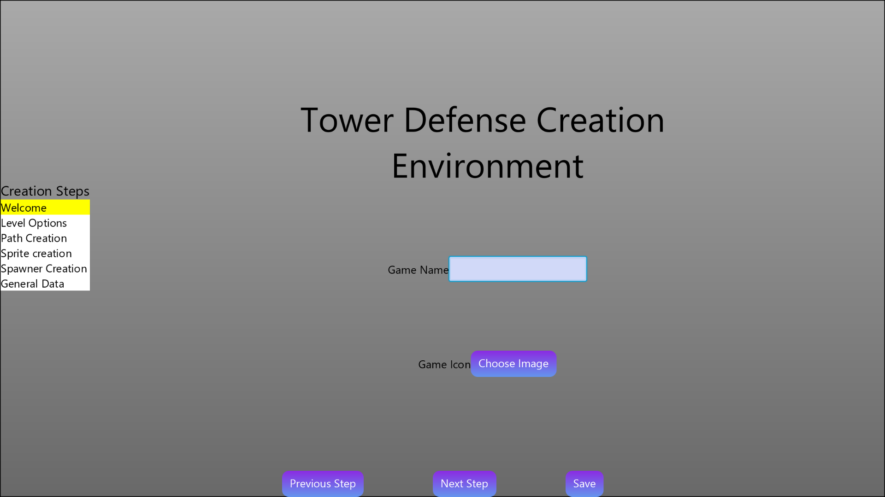
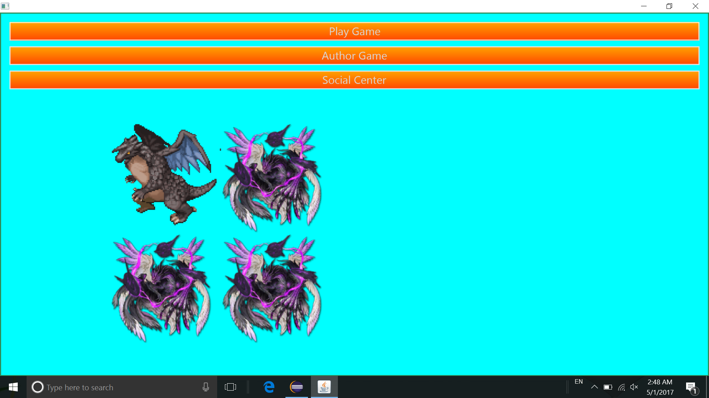

# voogasalad
---------------------
Game Authoring Engine Project
-----------------------
In this project, we constructed a game authoring environment for Tower Defense game genre. Meanwhile, this project also considered the extension to Real Time Strategy genre game.  In total, the project consists the following parts:

 - Game Authoring Environment
 - Game Engine
 - Game Player
 - Game Data Files

The game authoring environment provides users the ability to create a game, which will be stored as an XML document for later game play. Here is an image of the game environment: 

The game engine is the main logic of the game design. We use eventbus to handle different types of events. We call the pieces to create a game sprite. Different sprites have different components, which will describe the properties of the sprite. 

The game data is a classes of data to store the information of sprites, like heath, golds, etc.

The game player part is the part to show the game environment, he logging of the game, etc. ere is an image of our game player:

* names of all people who worked on ths project:  Jake Conroy, Tahia Emran, Yilin Gao, Alison Huang, Daniel Li, Matt Tribby, Keping Wang, Zhiyong Zhao
*  We started the project on March 23, and finished the project on May 4
* Role of each person: 
       * Jake Conroy: Game authoring environment
       * Tahia Emran: game model
       * Yilin Gao: player and engine
       * Alison Huang: Sprite, Components
       * Daniel Li: Game authoring environment
       * Matt Triby: Sprite, component
       * Keping wang: Game Engine and event bus
       * Zhiyong Zhao: Game player
* Files to start the project : 

App.java in the player package
* files for testing: 

One can find tester files in the package savedSprites to load up example towers and monsters. These are all of the file format "xml." Additionally, some sample games can be found in the top level directory with names like FinalPlantsVsZonbies.xml, Planets.xml, or 2paths2levels.xml. Finally, we have some Java tester classes in src.spritecreation and src.gameDevelopmentDemo
* Data or resources: 

The major resources are some images and sound files of the standard format (png, jpg, gif, mp3). There are also some properties files and CSS files, which can be found in src.resources.
* Information about the game:

To author a game, follow the wizard provided after clicking the Author Game button on the home screen. Things to note: make sure after creating a level, to click save this level's data; when creating a sprite, save out monsters (use minially components collidable, health, images, owner, path follower, and speed) to a file and then load them into the spawner screen and save the towers you make (with cost, attacker, images, owner, range, rangeshootingai, selectable, and skillset with the fireprojectile skill) to this game's sprites.
* Known bugs and problems with functionality:

If you add the skillset component and do not make your sprite selectable, then you will not be able to use the skills. Do not set selectable or collidable to polygon, this is not implemented. Do not use the TowerDefenceTypeInformation component on the sprite creation screen, it has no functionality. The upgrade cost is not settable, but it looks like you can input a value from the front-end. Addning too many rows or columns to the path creation screen will make it run off the edge of the screen.
* Extra features:

The user can control the zoom of the camera of the view by scrolling up and down while the mouse is over the screen. The user can make tower sprites into real time strategy players by giving them the move skill and the fire projectile skill. The user can also move throughout the infinitely scrolling view using their keyboard arrow keys. 
* Your impressions of the assignment to help improve it in the future:

Overall our group found this to be a good test of our knowledge and application of object oriented design. We made ample use of the patterns and skills that we have learned over the semester. We also enjoyed that the project was built around making games because many members of our team enjoy playing computer games at some point in our lives. Making games also ensures that certain aspects of coding are dealt with such as setting conditions when actions are completed (like level progression or losing), and providing enough flexibility in our design to extend to multiple levels, have different winning and losing criteria, and even allow our design to extend to other genres. For the future, we found out that it might be useful to have some more direction with the project from the start and we think having weekly demos would have been a useful mark that could have kept the entire team engaged throughout the project instead of only during demo weeks. 